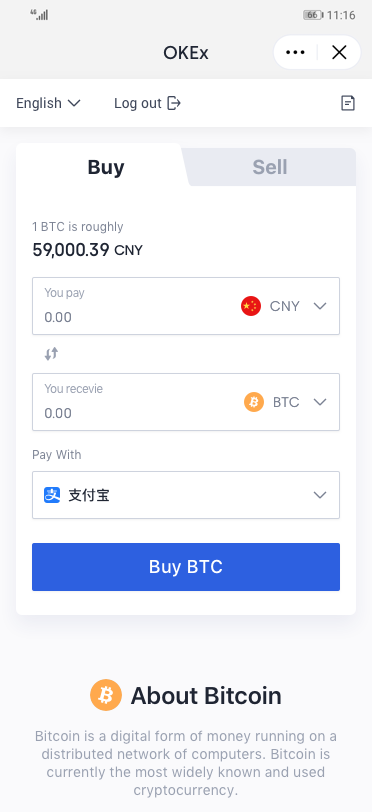
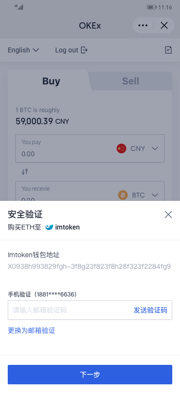
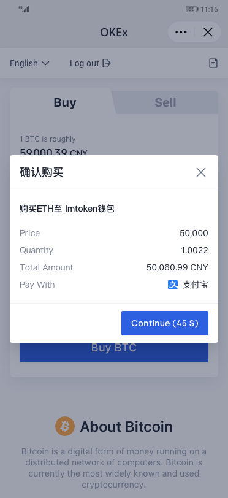
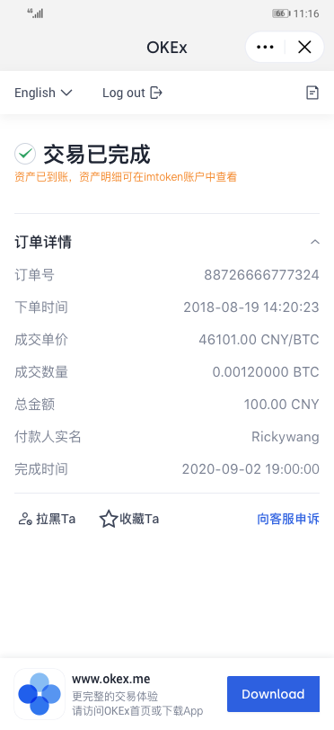

# OKEx-OTC-Access


## 请求入口
* 国内 http://www.okex.me
* 国外 http://www.okex.com

## 通信协议
HTTPS 协议

## 字符编码
所有接口的请求和响应数据编码皆为 UTF-8。


## 响应返回码
响应返回码（code）反应了OKEx OTC接入服务 API 调用和执行的概要结果。当返回码不为 200 时， 表示请求未正常执行，返回码描述 (msg) 对该结果进行了细化补充，用户可根据返回码判断 API 的执行情况。

所有接口调用返回值均包含 code 和 msg 字段， code 为返回码值，msg 为返回码描述信息，返回码表如下：

|返回码|返回码描述|说明|
|---|---|---|
|200|正常|接口调用成功|
|400|失败|request	请求参数缺失|
|429|限速|request	请求频率过快|

## 接口鉴权
OKEx OTC接入服务使用签名方法对接口进行鉴权，所有接口每一次请求都需要包含签名信息（signature 参数），以验证用户身份，防止信息被恶意篡改。

### 申请安全凭证
在第一次使用 API 之前，需申请安全凭证，安全凭证包括 parentId 和 publicKey ，parentId 是用于标识 API 调用者的身份，publicKey 是用于加密签名字符串和服务器端验证签名字符串的密钥。publicKey 必须严格保管，避免泄露。

### 签名生成算法
对于请求的所有参数都需要使用RSA加密算法使用publicKey进行加密。加密完成之后需要将结果作为signature放入请求负载中。

例如：
```
{   
    "fiatCurrency":"CNY",
    "cryptoCurrency":"BTC",
    "addressList":[
        {
            "address":"37ahQsgCy6bcnELyq92dhhDUy9J987r5aS",
            "tag":null
        }
    ],
    "type":"buy",
    "fee":"1",
    "amount":200,
    "signature":"xxxxxxx"  //将以上参数（不包括signature）加密之后放入请求负载中
}
```

加密代码Java参考实现：

```
public static String signWithRSAAndPublicKey(String data, String publicKey) {

        try {
            KeyFactory keyFactory = KeyFactory.getInstance("RSA");
            X509EncodedKeySpec x509EncodedKeySpec = new X509EncodedKeySpec(Base64.decodeBase64(publicKey));
            Cipher cipher = Cipher.getInstance(keyFactory.getAlgorithm());
            cipher.init(Cipher.ENCRYPT_MODE, keyFactory.generatePublic(x509EncodedKeySpec));
            byte[] dataBytes = data.getBytes();

            return Base64.getEncoder().encodeToString(segmentExecute(cipher, MAX_ENCRYPT_BLOCK, dataBytes));//MAX_ENCRYPT_BLOCK=127 
        } catch (NoSuchAlgorithmException | NoSuchPaddingException | InvalidKeyException | InvalidKeySpecException | BadPaddingException | IllegalBlockSizeException | IOException e) {
            log.info("RSA sign with public key error,msg:{}", e.getMessage(), e);
        }
        return "";
    }
    
     private static byte[] segmentExecute(Cipher cipher, int MAX_BLOCK, byte[] dataBytes) throws BadPaddingException, IllegalBlockSizeException, IOException {
        // 对数据分段处理
        int inputLen = dataBytes.length;
        ByteArrayOutputStream out = new ByteArrayOutputStream();
        int offSet = 0;
        byte[] cache;
        int i = 0;
        // 对数据分段加密
        while (inputLen - offSet > 0) {
            if (inputLen - offSet > MAX_BLOCK) {
                cache = cipher.doFinal(dataBytes, offSet, MAX_BLOCK);
            } else {
                cache = cipher.doFinal(dataBytes, offSet, inputLen - offSet);
            }
            out.write(cache, 0, cache.length);
            i++;
            offSet = i * MAX_BLOCK;
        }

        byte[] result = out.toByteArray();
        out.close();
        return result;
    }
```

## 快速集成

### 发起下单
#### 接口地址
请求方式POST

路径 /api/v1/c2c/check-order

#### 接口描述
该接口用于向okex传递下单信息，并返回渠道方将引导用户的目标地址（checkOutUrl）
#### 请求头

|参数名称|描述|
|---|---|
|parentId|由okex提供的唯一标识|
#### 请求参数
公共参数已省略，详细见 请求公共参数，其他参数如下：

|参数名称|类型|是否必选|描述|
|---|---|---|---|
|fiatCurrency|String| Y |法币|
|cryptoCurrency|String| Y |加密货币|
|addressList|List| Y |address必须，tag非必须，加密货币的地址列表,最多传递5个地址，最少一个|
|type|String| Y |sell 或者buy|
|fee|Number| N |手续费（除gas费用外，第三方向用户额外收取的手续费率）|
|amount|Number| Y |计价货币数量（购买时以法币为准）|
| signature |String| Y |上述参数通过RSA加密后的结果|

请求示例

```
{   
    "fiatCurrency":"CNY",
    "cryptoCurrency":"BTC",
    "addressList":[
        {
            "address":"37ahQsgCy6bcnELyq92dhhDUy9J987r5aS",
            "tag":null
        }
    ],
    "type":"buy",
    "fee":"1",
    "amount":200,
    "signature":""
}
```


#### 响应参数

|参数名称|类型|描述|
|---|---|---|
|code|Integer|成功 0 失败 非0，参见响应返回码|
|data|Object|响应体|
|checkOutUrl|String|重定向url|
|requestId | String |请求id|


响应示例

```
{
    "code": 0,
    "data": {
        "checkOutUrl": "https://www.okex.com/buy-crypto/access?requestId=dec0ba5f-a6d3-4cdf-b714-403330123d8a", //以实际返回结果为准
        "requestId": "dec0ba5f-a6d3-4cdf-b714-403330123d8a"
    },
    "msg": ""
}
```

### 回调地址
#### 接口地址
自行定义

#### 接口描述
由渠道方提供接受订单信息

#### 请求参数
公共参数已省略，详细见 请求公共参数，其他参数如下：

|参数名称|类型|是否必选|最大长度|描述|
|---|---|---|---|---|
|requestId|String|Y||请求ID|
|parentId|String|Y||okex提供的渠道唯一标识|
|fiatCurrency|String|Y|| 法币 |
|cryptoCurrency|String|Y|| 加密货币 |
|withdrawalAddress|Object|Y|| 提现地址 |
|withdrawalAddress.address|String|Y|| 提现地址 |
|withdrawalAddress.tag|String|N|| 提现TAG |
|type|String|Y|| 类型 buy 买 sell 卖 |
|fee|String|Y|| 手续费 |
|amount|Decimal|Y|| 数量 |
|tx_id|String|Y|| 区块链交易id，订单完成时返回|

请求示例

```
{
    "requestId"："dec0ba5f-a6d3-4cdf-b714-403330123d8a",
    "parentId": "okex",     
    "fiatCurrency": "CNY",
    "cryptoCurrency": "BTC",
    "withdrawalAddress": { 
        "address": "37ahQsgCy6bcnELyq92dhhDUy9J987r5aS",
        "tag": null
    },
    "type": "buy",
    "fee": "1",
    "amount": 200,
    "tx_id": "xxxxxxxxxxxxx"
}

```


#### 响应参数

|参数名称|类型|描述|
|---|---|---|
|code|Integer|成功 0|

响应示例

```
{
    "code"：0
}

```

## 交互示例




